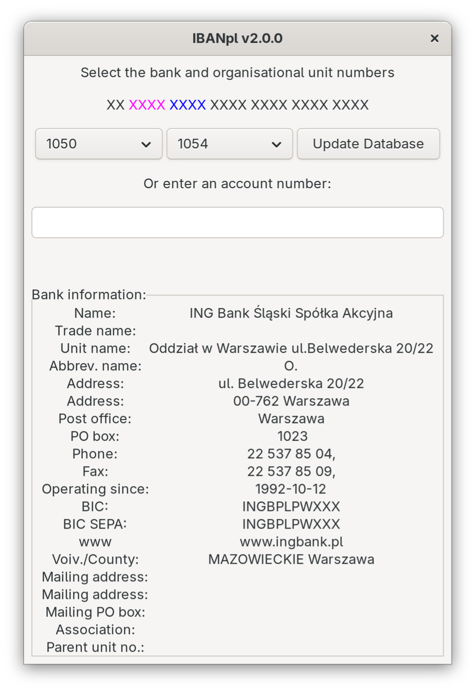
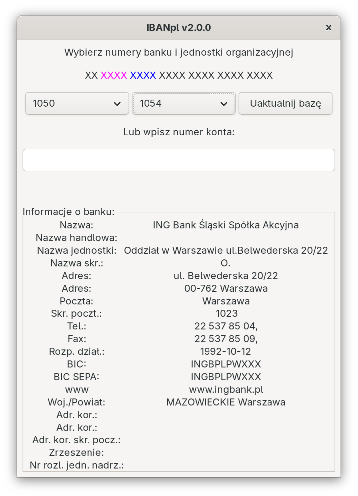

# IBANpl

Informacja o polskich bankach na podstawie numeru konta IBAN

Polish bank information based on the IBAN account number

Program oraz funkcje pozwalające na sprawdzenie poprawności numeru
konta oraz wyświetlenie informacji o polskich bankach
(nazwa banku, adres i inne dane) na podstawie numeru konta IBAN.

The program and accompanying functions allow you to check the
correctness of an account number and to display information about
Polish banks (bank name, address and other data) based on the IBAN
account number.

Program korzysta z bazy danych SQLite.

The program uses an SQLite database.

# Wymagania / Requirements

 * Python 3
 * GTK+ 3
 * SQLite 3

OS:
 * Linux
 * Windows

# Aktualizacja bazy danych banków / Bank database update

Po uruchomieniu programu wystarczy kliknąć przycisk _**Uaktualnij bazę**_ — aktualna
lista banków zostanie pobrana automatycznie z serwisu eWIB Narodowego Banku Polskiego
(https://ewib.nbp.pl/).

After starting the program, simply click the _**Update Database**_ button —
the current list of banks is downloaded automatically from the eWIB service
of the National Bank of Poland (https://ewib.nbp.pl/).

# Wspierane języki / Languages

Język interfejsu jest wybierany automatycznie na podstawie ustawień
systemowych (`LANGUAGE`/`LC_*`/`LANG`). Polskie teksty są językiem
źródłowym, tłumaczenie angielskie znajduje się w katalogu `locale/en`.
Dane banków i jednostek organizacyjnych pochodzące z serwisu eWIB NBP
są zawsze w języku polskim.

The interface language follows the system locale (`LANGUAGE`/`LC_*`/`LANG`).
Polish is the source language; an English translation is provided in
`locale/en/`. Bank and branch data from the NBP eWIB service is always
in Polish.

## License

This project is licensed under the GPL-3.0 License — see [COPYING](COPYING) for details.
